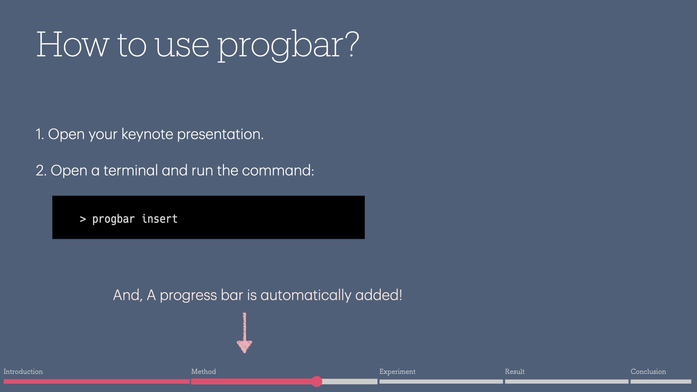

# progressbar-keynote

Embed a progress bar in your keynote presentation.



## Install

```bash
go install github.com/ry023/progressbar-keynote/cmd/progbar
```

## How to use

### Insert (or Update) progress bar

1. Open your keynote presentation.
2. Open a terminal and run the command:

```bash
progbar insert
```

#### Create Chapter

Add `Chapter: <title>` to presenter notes in slide page which starts a new chapter;

```
Chapter: Introduction
```

#### Skip progress bar

Add `Skip: true` to the presenter notes of that slide if you want to skip the progress bar for a specific slide;
**(Storonglly recommended to use this for the first title slide)**

```
Skip: true
```

### Just remove progress bar

1. Open your keynote presentation.
2. Open a terminal and run the command:

```bash
progbar remove
```
